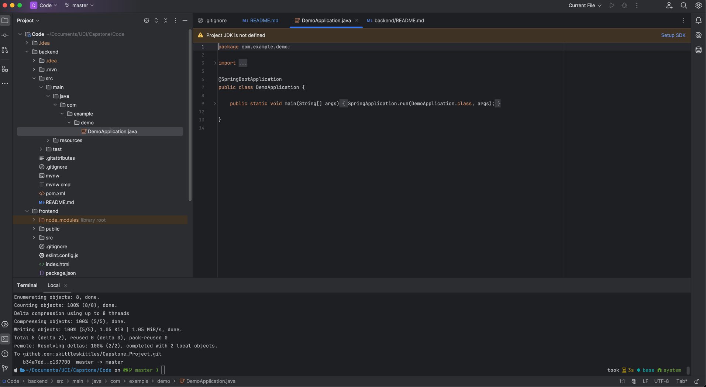
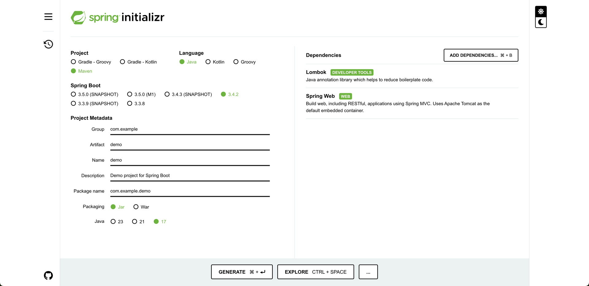
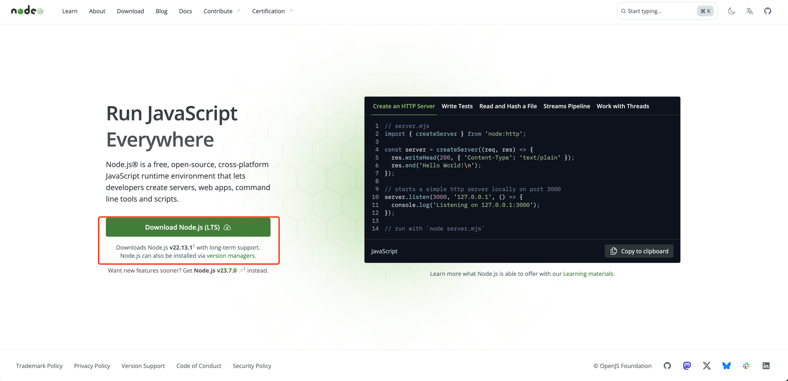
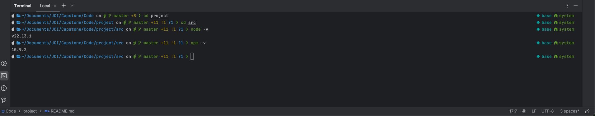
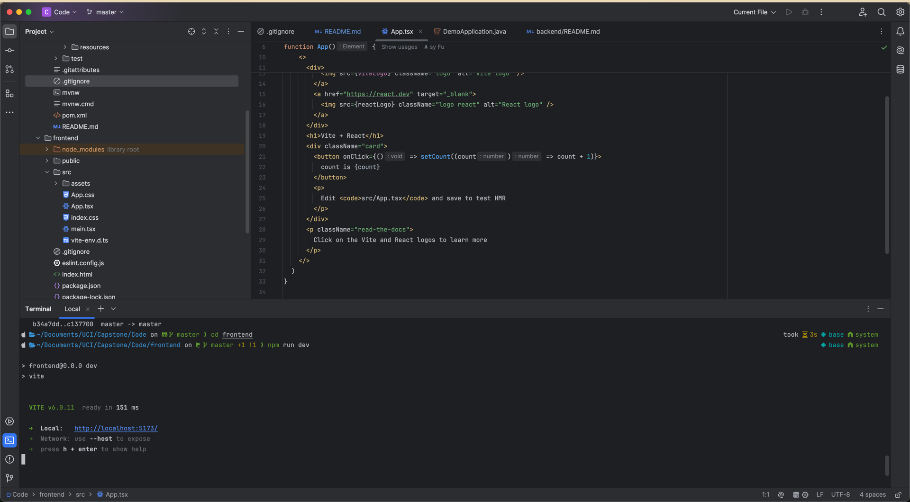
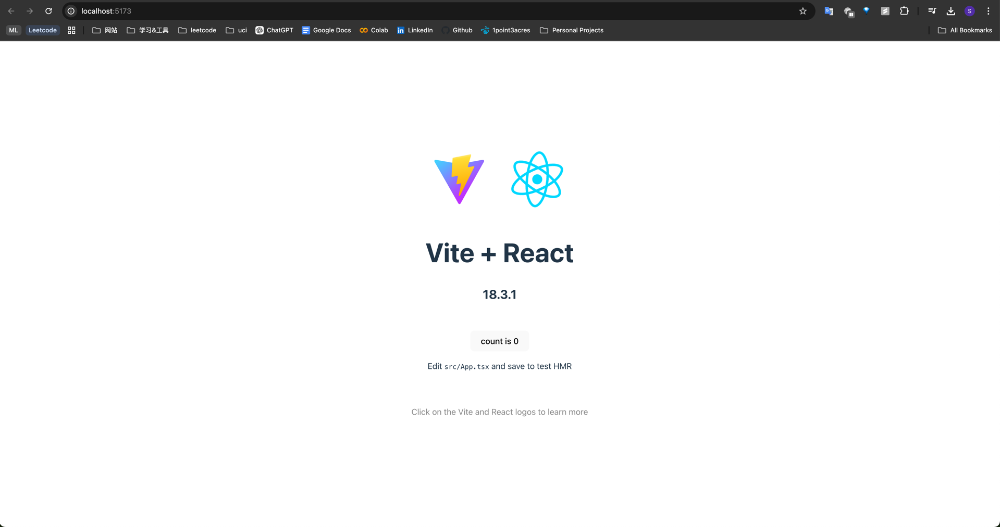

# Moopy - Your AI Mood Companion
An AI-Powered Emotional Support

SpringBoot + React (TypeScript)

# How to Run

1. Apply for a free IntelliJ IDEA Ultimate Edition Student License:
   https://www.jetbrains.com/community/education/#students
2. Open Project with IntelliJ IDEA
3. Open Terminal within IntelliJ IDEA
   
## BackEnd
The backend has already been bootstrapped under the backend folder using the following configurations:
[detail link](https://start.spring.io/#!type=maven-project&language=java&platformVersion=3.4.2&packaging=jar&jvmVersion=17&groupId=com.example&artifactId=demo&name=demo&description=Demo%20project%20for%20Spring%20Boot&packageName=com.example.demo&dependencies=lombok,lombok,lombok,web)

## FrontEnd
1. Install Node.js

   a. https://nodejs.org/en, v22.13.1
   
2. Check version:
   ```aiignore
   node -v  // should be node v22.13.1
   npm -v
   ```
   
3. Run App:
   ```aiignore
   cd frontend
   npm run dev
   ```
   Click host:
   
   
